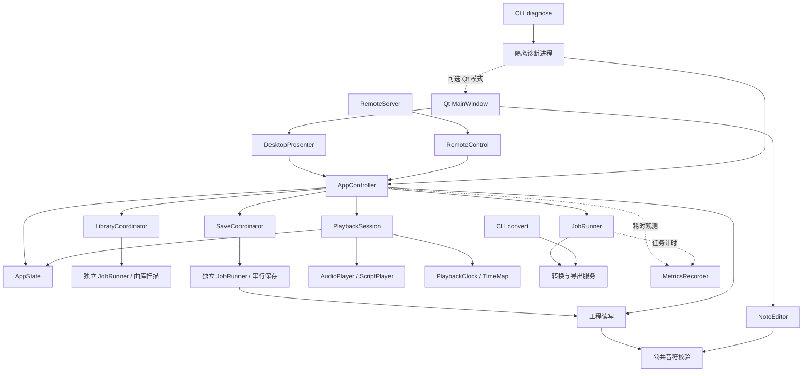

# 应用架构与维护约定

本文描述当前源码的模块、状态和执行边界。声部排名、正常导出任务的结果准备、曲库扫描和工程写入已移到后台；主线程仍负责快照准备、状态提交和展示。源码版本、便携版发布情况和某次测试结果分别以版本声明、构建报告及验收记录为准。

## 模块边界

本项目采用模块化单体。桌面通过轻量 MVP 适配，手机通过 HTTP 适配器访问同一个应用控制层。

普通命令行的 `inspect`、`convert` 直接复用解析、旋律和转换服务；诊断命令 `diagnose` 在隔离进程中驱动同一个应用控制层，按需接入真实 Qt 窗口。

| 模块 | 职责 |
| --- | --- |
| `app_state.py` | 当前工程、单调递增的工程版本、保存和导出版本、播放展示状态 |
| `controller.py` | 打开、保存、编辑、转换、试听、演奏、偏好更新与关闭等应用操作 |
| `jobs.py` | 单工作线程、任务上下文、取消信号、完成结果收取及可选工作线程钩子和计时 |
| `library_coordinator.py` | 独立曲库任务通道、目录与请求代次、一个可替换的待执行请求；不持有应用状态 |
| `save_coordinator.py` | 独立串行保存通道、快照请求排队和连续自动暂存合并；返回完成回执，不持有应用状态 |
| `playback_session.py` | 控制层所属线程中的播放组件，管理音频/演奏器、时钟、双向时间映射及共享状态中的播放字段；不决定导出和任务后续动作 |
| `presenter.py` | 接收控制层事件，将结果呈现给桌面；同步异常交给错误展示 |
| `gui.py` | 控件、对话框、界面定时器、文件夹监听和用户输入；不拥有业务状态 |
| `editor.py` | 曲谱绘制、输入交互、独立音符副本及撤销/重做；提交编辑结果给控制层 |
| `remote.py` | HTTP 监听、请求验证、认证、有界并发及线程安全的状态快照发布 |
| `remote_control.py` | 遥控命令队列、手机状态投影和版本化曲谱缓存；不访问 Qt 控件 |
| `midi.py`、`melody.py` | 原始 MIDI 解析和写出；声部推荐、旋律提取、移调及音域适配 |
| `notes.py` | 可编辑曲谱的公共类型、音域和时长限制、校验与规范化 |
| `project.py` | 工程格式、元数据验证、大小限制及原子保存 |
| `service.py` | 组织声部加载与排名、提取、工程生成、按键调度、事务性导出及控制层结果准备 |
| `rests.py`、`schedule.py`、`preview.py` | 派生休止压缩结果、生成按键事件、回读实际发声音符及渲染 WAV |
| `transport.py`、`playback.py` | 曲谱/演奏时间映射与播放时钟；原生音频和 AHK 演奏器生命周期 |
| `library.py`、`preferences.py`、`storage.py`、`paths.py` | 曲库发现、偏好与转换设置、日志及资源/数据路径 |
| `metrics.py` | 有容量限制的线程安全耗时收集、同步操作计时及统计摘要，不持有业务状态 |
| `performance.py` | 诊断 CLI、隔离进程、合成数据、后台延迟注入、Qt 延迟探针及 JSON 报告 |
| `diagnostic_backends.py` | 共用的可控执行器和无按键演奏器；`tests/workflow_fakes.py` 保留兼容导入 |
| `diagnostics.py` | 原有成品/源码自测及 `FakeAudio`，与性能诊断复用无声音频后端 |

`AppController`、`RemoteControl`、`AppState`、`JobRunner` 和耗时记录模块可在不导入 PySide6 的进程中使用。桌面展示、编辑器、设置及二维码界面依赖 Qt；性能诊断仅在启用 `--ui` 时加载 Qt。

## 转换与编辑数据流

1. `load_file()` 提交 `load_ranked_midi()`，后台读取 MIDI 并计算声部排名，返回 `LoadedParts`。主线程通过 `install_parts()` 安装有效结果并更新选轨展示。需要自动准备时，再提交转换任务。
2. `service.convert()` 当前会重新读取源 MIDI，由 `melody.prepare()` 完成旋律提取和音域适配，再生成经过统一校验的可编辑工程。
3. 编辑结果通过 `replace_notes()` 进入控制层，更新工程版本并使旧导出失效。编辑后导出使用当前工程快照，不重新读取 MIDI，也不重新应用提取阶段的八度调整。
4. 导出从工程音符派生长休止压缩和按键事件，再由事件回读实际发声音符；试听 WAV、导出 MIDI 和 AHK 脚本共用这一演奏时间安排。工程保留曲谱本身的时间。
5. 控制层通过 `convert_prepared()` / `export_project_prepared()` 请求导出。工作线程复用导出过程中已有的工程和实际音符，构建双向时间映射，完成后返回 `PreparedExport`。主线程核对取消信号和工程版本，再通过 `show_result()` 安装状态、自动暂存并加载试听；正常任务接收不再回读工程和音符文件或重建映射。当前 `listen()` 在导出过期时仍触发完整导出。

播放请求仍统一经过 `AppController`：控制层检查操作权限和导出版本，必要时提交任务，核对结果后决定试听、直接演奏或仅准备演奏器。`PlaybackSession` 负责已准备资源的加载、定位、暂停/续播、结束后重播、设备轮询及释放；采用后台准备好的映射对象，不在接收结果时重新构建。`playback.py` 继续负责原生音频命令和 AHK 进程，`transport.py` 继续负责纯时间映射和时钟算法。

普通 CLI 和现有服务调用仍使用 `convert()` / `export_project()`，返回 `(folder, report)`，完整产物保持兼容。控制层专用入口与它们共用内部转换和事务性导出实现。`PreparedExport` 的字段不可重新赋值，但嵌套字典、列表不是深度不可变；其数据独立于输入工程，返回后由主线程接管，工作线程不得继续修改。结果准备在导出目录发布前完成，失败时清理本次暂存并保留已有导出。显式 `show_result(folder, report)` 保留读取现有产物的同步兼容路径，不用于正常后台任务收取。

## 状态归属与操作

工程数据由控制层写入，视图和遥控只读取。禁止在窗口中新增一份工程、播放状态或 `dirty` 标志。新增业务操作优先写入控制层，再由桌面和手机分别接入。

控制层持有唯一的 `PlaybackSession`，在同一所属线程内委托它更新 `AppState` 的播放字段并发送展示事件；组件不修改工程、保存/导出版本或任务状态，也不持有第二份播放状态。桌面和手机不能直接调用该组件执行业务操作。`controller.audio`、`player`、`clock` 保留转发访问和测试替换能力，时间映射访问也转发到同一组件；已有构造器注入及无 Qt 诊断保持兼容。

`NoteEditor` 的音符副本用于交互预览和撤销，编辑完成后通过信号交给控制层校验。当前撤销历史保存在编辑器中，最多 100 步，每步复制整份音符列表；这不是可由桌面、手机共同调用的编辑历史服务。`AppState.project` 仍是可变字典，写入边界依靠控制层约定，不能通过原地修改字典绕过版本递增。

- `revision` 在打开、转换得到新工程、编辑音符、修改播放偏好时递增。
- `document_id` 在切换工程时递增，保存回执只能更新同一工程的状态。
- `saved_revision` 表示打开时的版本或最后一次手动保存成功回执对应的快照版本。保存期间继续编辑会保持未保存状态；自动暂存和导出不会推进它。
- `autosave_revision` 表示当前工程最近成功暂存的快照版本，`save_error` 记录保存失败信息。
- `export_revision` 表示现有导出对应的版本。保存工程不使旧导出变为有效。
- 手机谱面按工程版本、有效导出目录及播放偏好缓存，不再依赖列表的对象身份。
- 原始曲谱时间始终保留；现有演奏时间表和 `TimeMap` 负责实际播放与显示对应关系。

试听状态使用 `Transport` 枚举。任务的后续动作使用 `FollowUp`：无动作、试听、直接演奏或仅准备演奏器。任务与试听分别管理，避免用一个大枚举混合所有状态组合。

停止试听清除待执行试听；停止演奏清除待执行演奏或准备动作。这些业务清理仍由控制层完成，再调用播放组件操作设备；组件内部停止设备不清除任务后续动作。取消任务清除后续动作并设置取消信号。读取后自动转换所需的选歌信息跟随任务上下文，不存在窗口和遥控各自持有的自动播放标志。

## 线程与生命周期

控制层由其所属主线程调用，不是可供多个线程直接写入的共享对象。每个 `JobRunner` 同一时间只有一个当前任务；工程、曲库和保存分别使用独立的单工作线程通道。工作参数为路径、不可变转换选项或独立工程快照；支持取消的函数另外接收取消信号。Qt 定时器每 100 毫秒调用 `controller.poll()`，在主线程收取三个通道的结果，分别核对工程版本、曲库目录与请求代次、保存快照的工程身份与版本。

当前的执行分工如下：

| 执行位置 | 当前承担的工作 |
| --- | --- |
| 控制层所属主线程 | 工程状态变更、已排名声部安装、曲库结果安装、工程打开/校验、保存及导出前快照准备、保存回执处理、已准备导出结果安装、播放器操作；显式读取既有导出的兼容入口仍同步执行 |
| Qt 主线程展示 | 声部摘要和表格、曲库菜单、编辑交互、音符列表复制、撤销历史、绘制和位置刷新 |
| 工程 `JobRunner` 单工作线程 | MIDI 读取及声部排名、转换和完整导出，包括 WAV 渲染及导出结果的双向时间映射准备；可选 `before_work` 钩子在实际任务函数前执行 |
| 曲库 `JobRunner` 独立单工作线程 | 目录枚举、catalog 读取、文件哈希和条目准备；不操作 Qt、播放器或工程状态 |
| 保存 `JobRunner` 独立单工作线程 | 对独立快照执行工程校验、序列化和原子写入，复用 `project.save_project()`；不修改应用状态 |
| HTTP 请求线程 | 验证请求、读取已发布快照、将命令入队并有界等待结果，不修改控制层或 Qt |

桌面编辑后的自动暂存由展示适配器启动 400 毫秒单次定时器，超时后由控制层复制独立快照并提交保存队列。曲库监听通知采用短暂防抖后提交后台扫描；文件夹监听注册及菜单展示仍在 Qt 主线程执行。

`SaveCoordinator` 最多保留一个当前请求和 16 个待执行请求；队列满时明确报错，保留已接受的请求。只合并队尾同一工程、同一路径的连续自动暂存，不跨手动保存、恢复保护或关闭请求合并。所有写入按提交顺序执行，不取消已接受的保存。手动保存和随后的自动暂存共用同一份独立快照；手动保存成功后才更新路径和 `saved_revision`。切换前的保护请求依次写入恢复文件和自动暂存文件，每个文件单独原子替换；第二次写入失败可能留下恢复文件，但不会继续切换工程。

`saving` 独立表示保存通道状态，普通保存期间可以继续编辑。需要保护当前工程后才能切换或关闭时，`transition` 暂时限制打开、编辑、保存、转换和播放；停止试听、停止演奏仍可用，并清除等待中的自动播放后续动作。候选工程先读取校验，再保护当前工程；保护回执的工程身份和版本匹配后才执行切换。已无未保存编辑但仍有保存请求时，使用队列屏障等待先前请求。

`refresh_library()` 返回请求代次，不代表扫描完成。`LibraryCoordinator` 最多持有一个当前任务和一个最新待执行请求；同目录重复通知合并为一次后续扫描，跨目录请求同时取消旧任务。切换曲库偏好会由控制层主动提交新扫描。旧列表在刷新期间保留，只有目录和代次均匹配的结果才通过 `install_library()` 安装。`AppState.library_revision` 表示最近成功安装的请求代次，`library_root` 对应当前列表，`library_error` 保存最近有效扫描的失败信息；这些字段不改变工程 `revision`。过期结果和过期失败均忽略。

`busy` 仍只表示工程任务；`library_refreshing` 单独表示曲库任务，不阻止编辑、保存、试听或演奏。扫描检查枚举和条目处理之间的取消信号，哈希每 64 KiB 检查一次；单次系统文件调用不能保证即时中断。有效扫描遇到权限或读取失败时保留旧曲库并报告错误；不存在的目录仍视为空曲库，兼容目录删除/重建的监听流程。菜单展开期间延后重建 QAction，关闭菜单后展示最新列表，避免刷新打断选歌。

手机刷新命令立即返回“正在刷新曲库”，随后状态快照通过 `library_refreshing`、`library_revision` 和通用 `library_error` 描述完成或失败；原有曲库和播放字段保持兼容。网络线程仍只发布请求，实际状态变更和错误处理由主线程完成。

网络线程把指令放入有界队列并等待结果；桌面定时器调用遥控适配器的 `poll()`，再调用控制层。模态对话框的阻塞条件通过回调注入，不把 Qt 依赖引入遥控模块。

任务取消是协作式的：清除后续动作并设置 `Event`，通常要等任务结束且主线程收取结果后才解除 `busy`。`load_ranked_midi()` 在读取前、读取后和排名后检查取消；原始 `read_midi()`、排名和旋律提取内部仍没有取消检查，不能即时中断各自的耗时循环。导出和音频渲染会检查取消信号，结果准备后也在发布前检查。诊断钩子的等待可被取消唤醒，不代表整个解析和提取过程已支持即时中断。

桌面关闭调用 `close(wait=False)`，提交最新快照后保持窗口和轮询可用；保存完成才发出 `close_ready`，由 Qt 延后再次关闭窗口。保存等待期间不安装工程任务结果，防止迟到导出触发自动播放。任一保存失败都会取消待执行切换或关闭，恢复操作并保留应用及后台通道；已接受的其他保存仍按序处理。默认 `close(wait=True)` 和 `wait_for_saves()` 仅供无界面调用和测试清理，在所属线程等待同一保存流程，不能用于桌面交互。

成功关闭时保存队列已清空，再关闭保存通道、取消工程和曲库任务、丢弃待执行扫描并停止播放器；关闭后不再发布事件或接收迟到结果。已完成且成功落盘的导出不会因结果未被界面接收而被删除。诊断进程清理临时数据前等待三个执行器退出。

播放组件没有工作线程。原生音频调用仍在控制层所属线程执行；编辑后即使音频关闭失败，也清除旧时长和映射并尝试停止演奏器；关闭时即使音频释放失败，也尝试停止演奏器。错误日志和控制层的关闭/失败处理沿用原有流程，拆分不改变设备错误语义。

控制层通过 `subscribe()` 同步发布轻量事件。订阅者负责展示及展示侧定时器调度，不承担转换、保存或自动播放决策；展示订阅者的工作会计入调用它的控制层操作耗时。测试可注入执行器、播放器及时间源，无需真实声音或游戏输入。

播放动画按约 60 Hz 更新，使用单调时钟对音频位置插值，再由播放器反馈校正；进度条以浮点位置绘制，避免整数像素步进影响观感。这只影响显示，导出的音符时间与按键编排不因动画频率改变。

## 耗时观测与诊断边界

`AppController` 可选注入 `metrics` 和 `before_work`，默认关闭。三个任务通道共用耗时收集器；`before_work` 保持只作用于工程通道，曲库和保存测试可通过 `library_executor`、`save_executor` 注入共用的可控执行器。耗时收集器只负责观测；后台钩子只在工作线程运行，二者都不能改变工程版本、任务后续动作或应用状态的主线程归属。收集器内部使用锁不代表控制层可以并发写入。

`performance.py` 的父进程负责临时数据目录、子进程总超时和报告收取；子进程通过同一个控制层及可选 `MainWindow` 执行业务，不另建一套转换或编辑流程。正常诊断使用真实工作线程和时钟，声音、游戏按键使用假后端；原有成品自测继续由 `diagnostics.py` 提供。

计时分段、注入方法、CLI 参数和 JSON 协议集中维护在 [性能诊断](diagnostics.md)。

## 音符校验边界

原始 MIDI 可以包含完整 MIDI 音域和多声部，不能在读取阶段应用口琴曲谱约束。旋律提取和八度调整完成后，可编辑工程统一调用 `normalize_score_notes()`。

公共校验会排序、补齐默认力度 80、拒绝布尔时间和非有限数值、检查音域与数量/时长限制、处理允许范围内的浮点接缝，并返回独立副本。真实重叠始终拒绝；反复规范化不会累计改变时间。

编辑吸附和最小拖动长度仍由编辑器管理；按键提前量和松键间隔仍由调度器管理。空工程可以保存，不能导出。`.hstudio` 格式仍为版本 1，现有命令行和手机接口保持兼容。

## 旋律算法约束

旋律处理保持在无 Qt 的 `melody.py` 内。`rank_parts()` 通过时间事件扫描统计重叠发声比例，结合声部在全曲中的发声覆盖、音程连续性、音高分布、时值和音域可达性评分，名称只作为弱提示。分数不是概率，不声称全曲旋律一定在同一声部。

`simplify(..., mode='continuous')` 使用保留 32 条候选路线的束搜索动态规划，综合时值、音高、力度、音程及截断长音代价。跳过当前起音是合法分支，回溯得到候选旋律后统一裁去重叠。搜索是有界近似，不保证全局最优或音乐学意义上的正确旋律；默认仍为 `sustain`。所有模式仅将实际重叠且起音相近的音归组，避免吞掉连续短音。

整体八度适配以音符数和相对时值共同加权。可选 `Options.phrase_octave` 在仍存在超音域音符时，按至少 0.35–1 秒的休止近似分句，对整句八度偏移做动态规划：先减少加权丢音，再减少乐句间的八度切换及偏移。单句无法容纳时仍记录丢音，不对单音逐个折叠。`report.octave_adjustments` 记录相对于整体移调的附加半音数、转换后曲谱时间范围和保留音符数；属于提取历史，编辑和重新导出不会再次应用。

`scripts/evaluate_melody.py` 对人工标注的小例子比较漏音、混入音、截断和精确匹配，另对内置曲库测量有效性、丢音及耗时，并检查 10 万音符的连续模式。内置曲库没有完整旋律标注，不应把有效性检查写成准确率；真实曲目质量仍需标注和试听评估。算法为独立的轻量规则实现，未引入外部模型或运行库。

## 回归与构建

`test_controller.py` 验证无 Qt 的应用工作流、后台结果准备的线程归属及主线程状态提交；`test_workflow_regressions.py` 保留桌面行为契约；`test_save_coordinator.py` 覆盖保存顺序、快照独立性、合并边界、版本回执、切换/关闭失败及执行器提交失败；`test_playback_session.py` 覆盖压缩空白后的定位、暂停/续播、结束重播、映射接管、播放期间工程不变及音频释放失败；`test_performance.py` 验证计时分段、样本容量、取消、过期结果、诊断 CLI、个人数据隔离、超时、导出及 Qt 自动保存。`test_cli.py` 通过子进程验证普通 `inspect` / `convert` 的 JSON 和完整产物。已有 Qt 交互、真实 HTTP 请求和导出一致性测试继续保留。

构建由 `scripts/build.ps1` 组织完整测试、暂存打包、成品检查和安装。`package_portable.py` 在安装时保留用户文件，失败则回滚运行资源；本次缓存和自测数据留在受控暂存目录内并在流程结束后清理。源码版本变更与便携版发布是两个结果，不能相互替代。

环境搭建和发布命令见 [README 的开发说明](../README.md#开发)，执行约束见 [协作指南](../AGENTS.md#版本与打包)。

## 便携路径

`application_root()` 在成品中固定为 EXE 所在目录，在源码运行中为工程根目录。`data_root()` 默认返回该目录下的 `data`；`default_library_root()` 返回 `samples`。`resource_root()` 只用于只读运行资源，不再用于曲库。成品不包含 `_internal/samples`。

默认曲库设置保存为空字符串；位于程序内的自定义曲库保存为相对路径，读取时相对于 `application_root()` 解析。外部绝对路径与显式 `HARMONICA_STUDIO_HOME` 覆盖仍受支持。便携版与源码开发数据相互独立。

## 性能现状与后续边界

当前诊断覆盖大曲谱编辑/自动保存、大曲库刷新、声部加载与安装、完整导出与结果安装。声部排名、正常导出任务的结果准备、曲库扫描和工程写入已后台化，主线程仍承担快照复制、编辑校验、声部表格和曲库菜单展示及音频加载。具体数值受机器、数据和显示后端影响，以每次 JSON 报告为准；改造前后报告为 `verification/controller-{load,export,library,save}-{before,after}.json`，说明见 `verification/历史更新.md`。报告按需生成，不保证源码仓库包含本机的验证产物。

播放职责拆分已完成，未改变线程分工或原生播放算法；对应导出场景前后报告为 `verification/controller-playback-{before,after}.json`。它用于检查行为和性能回退，不作为整体提速的依据。

以下优化尚未实施，后续修改应分别建立基线和回归保护：

| 方向 | 必须保留的约束 |
| --- | --- |
| 试听与完整导出拆分 | 共用同一演奏时间表，不让试听、MIDI 和 AHK 的时间安排分叉 |
| 增量编辑/撤销与快照共享 | 继续统一音符校验，避免共享可变数据跨线程；若将编辑能力扩展到手机，编辑命令与历史应共用控制层下的实现 |
| 遥控静态数据缓存与取消检查细化 | 保留状态快照和命令队列边界；减少曲库/谱面重复处理，在耗时循环中增加协作式取消检查 |

后台声部排名和导出结果准备保留工程通道的原有版本、取消及后续动作校验；曲库使用独立的目录和代次校验；保存按提交顺序写入独立快照，再由主线程处理版本回执。三个通道都没有并行修改业务状态的能力。
