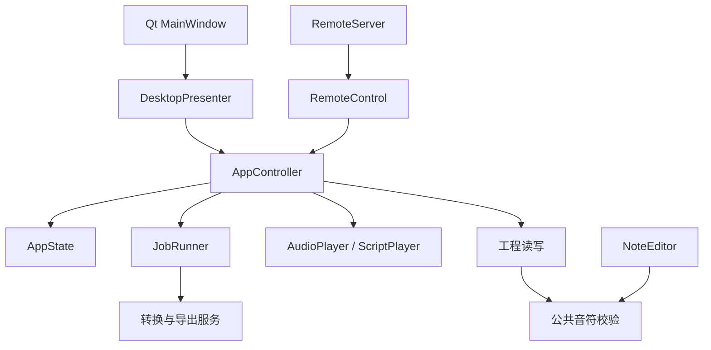

# 应用架构与维护约定

## 模块边界

本项目采用模块化单体。桌面通过轻量 MVP 适配，手机通过 HTTP 适配器访问同一个应用控制层。



| 模块 | 职责 |
| --- | --- |
| `app_state.py` | 当前工程、单调递增的工程版本、保存和导出版本、播放展示状态 |
| `controller.py` | 打开、保存、编辑、转换、试听、演奏、偏好更新与关闭等应用操作 |
| `jobs.py` | 单工作线程、任务上下文、取消信号与完成结果收取 |
| `presenter.py` | 接收控制层事件，将结果呈现给桌面；同步异常交给错误展示 |
| `gui.py` | 控件、对话框、界面定时器、文件夹监听和用户输入；不拥有业务状态 |
| `remote_control.py` | 遥控命令队列、手机状态投影和版本化曲谱缓存；不访问 Qt 控件 |
| `notes.py` | 可编辑曲谱的公共类型、音域和时长限制、校验与规范化 |
| `project.py` | 工程格式、元数据验证、大小限制及原子保存 |
| `service.py` | 保持原有转换与事务性导出流程 |

`AppController`、`RemoteControl`、`AppState` 和 `JobRunner` 可在不导入 PySide6 的进程中使用。Qt 只在桌面入口、编辑器和二维码界面中使用。

## 状态归属与操作

工程数据由控制层写入，视图和遥控只读取。禁止在窗口中新增一份工程、播放状态或 `dirty` 标志。新增业务操作优先写入控制层，再由桌面和手机分别接入。

- `revision` 在打开、转换得到新工程、编辑音符、修改播放偏好时递增。
- `saved_revision` 表示用户最后一次手动保存或打开时的版本。自动暂存和导出不会推进它。
- `export_revision` 表示现有导出对应的版本。保存工程不使旧导出变为有效。
- 手机谱面按工程版本、有效导出目录及播放偏好缓存，不再依赖列表的对象身份。
- 原始曲谱时间始终保留；现有演奏时间表和 `TimeMap` 负责实际播放与显示对应关系。

试听状态使用 `Transport` 枚举。任务的后续动作使用 `FollowUp`：无动作、试听、直接演奏或仅准备演奏器。任务与试听分别管理，避免用一个大枚举混合所有状态组合。

停止试听清除待执行试听；停止演奏清除待执行演奏或准备动作。取消任务清除后续动作并设置取消信号。读取后自动转换所需的选歌信息跟随任务上下文，不存在窗口和遥控各自持有的自动播放标志。

## 线程与生命周期

控制层由其所属主线程调用，不是可供多个线程直接写入的共享对象。`JobRunner` 将工作交给单个线程，后台函数只接收独立数据快照和取消信号。Qt 定时器调用 `controller.poll()`，在主线程收取结果并核对工程版本。

网络线程把指令放入有界队列并等待结果；桌面定时器调用遥控适配器的 `poll()`，再调用控制层。模态对话框的阻塞条件通过回调注入，不把 Qt 依赖引入遥控模块。

关闭时先保存工程；保存失败则保持应用可用。随后取消后台任务、停止播放器；关闭后不再发布事件或接收迟到结果。已完成且成功落盘的导出不会因结果未被界面接收而被删除。

控制层通过 `subscribe()` 发布轻量事件。订阅者负责展示，不承担转换、保存或自动播放决策。测试可注入执行器、播放器及时间源，无需真实声音或游戏输入。

## 音符校验边界

原始 MIDI 可以包含完整 MIDI 音域和多声部，不能在读取阶段应用口琴曲谱约束。旋律提取和八度调整完成后，可编辑工程统一调用 `normalize_score_notes()`。

公共校验会排序、补齐默认力度 80、拒绝布尔时间和非有限数值、检查音域与数量/时长限制、处理允许范围内的浮点接缝，并返回独立副本。真实重叠始终拒绝；反复规范化不会累计改变时间。

编辑吸附和最小拖动长度仍由编辑器管理；按键提前量和松键间隔仍由调度器管理。空工程可以保存，不能导出。`.hstudio` 格式仍为版本 1，现有命令行和手机接口保持兼容。

## 回归与构建

旋律处理保持在无 Qt 的 `melody.py` 内。`rank_parts()` 通过时间事件扫描统计重叠发声比例，结合声部在全曲中的发声覆盖、音程连续性、音高分布、时值和音域可达性评分，名称只作为弱提示。分数不是概率，不声称全曲旋律一定在同一声部。

`simplify(..., mode='continuous')` 使用保留 32 条候选路线的束搜索动态规划，综合时值、音高、力度、音程及截断长音代价。跳过当前起音是合法分支，回溯得到候选旋律后统一裁去重叠。搜索是有界近似，不保证全局最优或音乐学意义上的正确旋律；默认仍为 `sustain`。所有模式仅将实际重叠且起音相近的音归组，避免吞掉连续短音。

整体八度适配以音符数和相对时值共同加权。可选 `Options.phrase_octave` 在仍存在超音域音符时，按至少 0.35–1 秒的休止近似分句，对整句八度偏移做动态规划：先减少加权丢音，再减少乐句间的八度切换及偏移。单句无法容纳时仍记录丢音，不对单音逐个折叠。`report.octave_adjustments` 记录相对于整体移调的附加半音数、转换后曲谱时间范围和保留音符数；属于提取历史，编辑和重新导出不会再次应用。

`scripts/evaluate_melody.py` 对人工标注的小例子比较漏音、混入音、截断和精确匹配，另对内置曲库测量有效性、丢音及耗时，并检查 10 万音符的连续模式。内置曲库没有完整旋律标注，不应把有效性检查写成准确率；真实曲目质量仍需标注和试听评估。算法为独立的轻量规则实现，未引入外部模型或运行库。

```powershell
.\scripts\test.ps1 -Python .venv\Scripts\python.exe
.\scripts\build.ps1 -Python .venv\Scripts\python.exe -DistPath build/p1-p2-portable
```

省略 `-DistPath` 时仍输出到 `app`。独立验证产物不会替换正在使用的便携版。

`build.ps1 -Version 1.4.7` 可一次完成版本同步、测试和打包；根目录 `打包.cmd` 提供交互入口，Python 默认优先采用项目 `.venv`。运行中的目标程序在测试前即拦截。`scripts/set_version.py` 校验四处版本声明后统一更新，历史报告不改写。

构建使用同一个 Python 运行 `test.ps1`；测试失败立即终止，不生成资源或调用打包器。随后在 `build/portable-stage-*` 生成程序，将种子曲库复制到 EXE 旁边，并运行成品检查。PyInstaller 工作目录和自测数据均位于本次暂存目录内，结束时校验路径和链接后统一清理；仅保留报告及截图。详细日志固定写入 `verification/build.log`，控制台显示四步进度。通过后由 `scripts/package_portable.py` 保留用户文件、替换运行资源，安装失败回滚，成功后清理短期备份。现有曲库保持原样，不覆盖同名自编曲谱或恢复已删除示例。`smoke.ps1 -ExecutablePath` 可复验移动后的程序。

## 便携路径

`application_root()` 在成品中固定为 EXE 所在目录，在源码运行中为工程根目录。`data_root()` 默认返回该目录下的 `data`；`default_library_root()` 返回 `samples`。`resource_root()` 只用于只读运行资源，不再用于曲库。成品不包含 `_internal/samples`。

默认曲库设置保存为空字符串；位于程序内的自定义曲库保存为相对路径，读取时相对于 `application_root()` 解析。外部绝对路径与显式 `HARMONICA_STUDIO_HOME` 覆盖仍受支持。便携版与源码开发数据相互独立。

`test_controller.py` 验证无 Qt 的应用工作流；`test_workflow_regressions.py` 保留桌面行为契约；已有 Qt 交互、真实 HTTP 请求和导出一致性测试继续运行。诊断脚本通过 `controller.state` 读取应用状态。

验收记录见 `verification/p1-p2-acceptance.md`。试听与完整导出拆分、增量撤销记录属于后续 P3/P4，本次保留原有机制。
